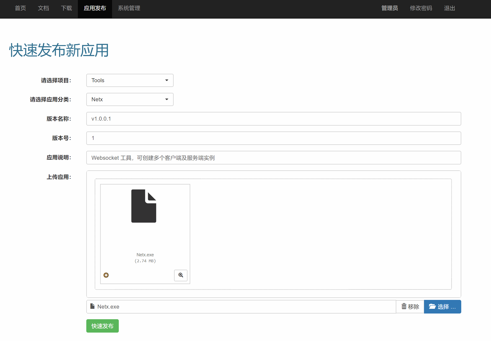

# golang-publish-web
基于go的产品版本发布管理web，方便部门内部产品版本发布下载，产品文档说明、产品部署视频教程上传下载，在线查看等

[演示地址](http://dl.lichunorz.com) 用户名:lichunorz 密码:lichunorz

[下载地址](https://github.com/atsushinee/golang-publish-web/releases)

### windows
 > 解压后,双击 exe 启动，浏览器输入 http://localhost:1912  用户名:admin 密码:adminadmin
 
 > 新用户默认密码:111111